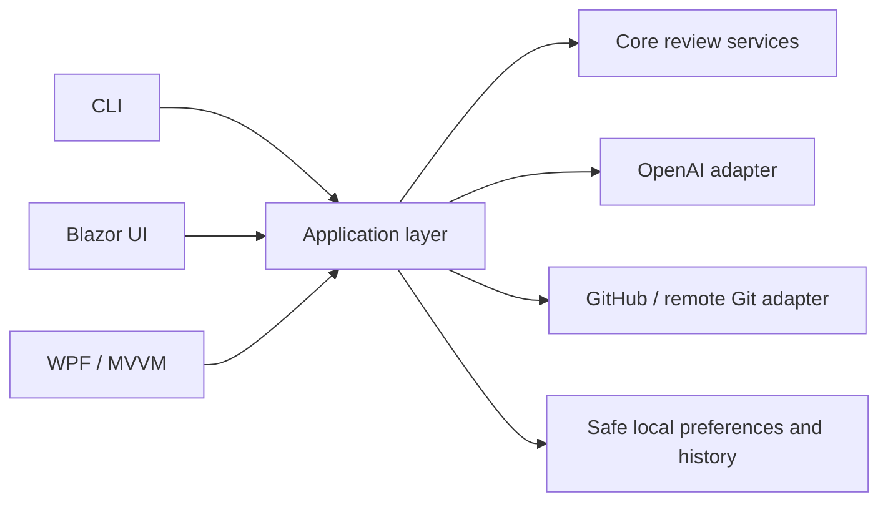
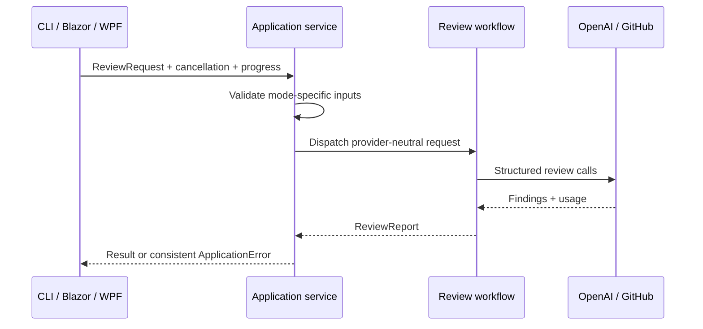

# AI Code Reviewer — Versions 1–8

A C#/.NET code-review application with three front ends: a command line, a Blazor web UI, and a Windows WPF desktop UI. All three call the same application layer and support single files, local and remote repositories, semantic retrieval, agent-guided investigation, GitHub pull requests, and coordinated specialist reviews.

The AI reports structured findings with severity, category, explanation, file/location, and a suggested improvement. Findings can cover correctness, maintainability, performance, security, poor practices, refactoring, error handling, and tests. AI output is advisory and must be verified by a person.

## Requirements

- .NET 8 SDK or newer
- Git on `PATH` for remote-repository reviews
- An OpenAI API key and a model supporting Structured Outputs
- Windows for the WPF desktop app

## Build and test

From the repository root:

```powershell
dotnet restore AiCodeReviewer.slnx
dotnet build AiCodeReviewer.slnx --no-restore
dotnet test AiCodeReviewer.slnx --no-build --no-restore
```

Tests use fakes and deterministic local data. They do not call OpenAI or GitHub.

## Configure providers securely

Set credentials in the process environment or a production secret manager. Do not paste keys into either GUI or commit them to the repository.

```powershell
$env:OPENAI_API_KEY = "your-api-key"
$env:OPENAI_MODEL = "your-structured-output-model"
$env:OPENAI_EMBEDDING_MODEL = "text-embedding-3-small" # optional
$env:OPENAI_BASE_URL = "https://api.openai.com/v1/"     # optional
$env:GITHUB_TOKEN = "fine-grained-token"                # optional for public read; required to publish
```

Both GUIs show only whether configuration is present. They never display or edit credential values. Remote Git URLs containing credentials are rejected; use Git Credential Manager instead.

## Run the graphical apps

### Blazor web UI

```powershell
dotnet run --project src/AiCodeReviewer.Blazor
```

Open the local address printed by .NET. Select a mode and fill only the fields shown for that mode. A browser cannot grant this server arbitrary access to a folder on another computer: file and folder paths must exist on the machine running the Blazor server.

The web UI provides live progress, cancellation, configuration status, token usage, structured findings, search/filter/sort, JSON and Markdown downloads, recent-review metadata, and preferences. To protect browser performance, it displays at most 200 matching findings; exports always contain the complete report.

### Windows desktop UI

```powershell
dotnet run --project src/AiCodeReviewer.Wpf
```

The WPF app provides native file/folder pickers, progress and cancellation, a virtualized sortable findings grid, search/filter/sort, report export, configuration status, recent-review metadata, and preferences. It is DPI-aware through modern WPF defaults and exposes labels/live status to Windows accessibility services.

## Run the CLI

```powershell
# One source file
dotnet run --project src/AiCodeReviewer.Cli -- review-file "C:\code\Example.cs"

# Local repository (defaults: 50 files and 250,000 characters)
dotnet run --project src/AiCodeReviewer.Cli -- review-repo "C:\code\project" --max-files 20 --max-chars 100000

# Remote GitHub or other HTTPS Git repository
dotnet run --project src/AiCodeReviewer.Cli -- review-remote https://github.com/OWNER/REPOSITORY.git --max-files 20

# Repository with semantic retrieval (RAG)
dotnet run --project src/AiCodeReviewer.Cli -- review-rag "C:\code\project"

# Agent-guided repository investigation
dotnet run --project src/AiCodeReviewer.Cli -- review-agent "C:\code\project"

# GitHub pull request: dry run
dotnet run --project src/AiCodeReviewer.Cli -- review-pr OWNER REPOSITORY 42

# Publish only after inspecting the dry-run drafts
dotnet run --project src/AiCodeReviewer.Cli -- review-pr OWNER REPOSITORY 42 --approve

# Five coordinated specialist perspectives
dotnet run --project src/AiCodeReviewer.Cli -- review-specialists "C:\code\Example.cs"
```

### CLI and GUI mapping

| CLI command | GUI review mode |
|---|---|
| `review-file` | Single source file |
| `review-repo` | Local repository |
| `review-remote` | Remote Git repository |
| `review-rag` | Repository with semantic context |
| `review-agent` | Agent-guided repository review |
| `review-pr` | GitHub pull request |
| `review-specialists` | Specialist review team |

## GitHub safety

Pull-request review is dry-run by default in every interface. The GUIs first show draft inline comments, then require a fresh checkbox confirmation and a separate publish action. The CLI requires `--approve`. Publishing creates a GitHub `COMMENT` review; it never approves or merges a pull request.

Use a fine-grained token with the minimum repository permissions. Public PR review may work without a token, but private PR access and publishing require `GITHUB_TOKEN`.

## Reports, recent history, and preferences

JSON exports preserve the structured application contract; Markdown exports are human-readable. Reports include model and token usage when returned by the provider.

The GUIs store preferences and at most 20 recent-review metadata entries under `%LOCALAPPDATA%\AiCodeReviewer`. Stored preferences are default mode, repository limits, export format, and theme. History contains only ID, timestamp, mode, finding count, and an optional report path—never source code, repository URLs, prompts, API keys, or tokens. Deleting that folder resets local GUI state.

## Architecture





Project responsibilities:

- `AiCodeReviewer.Core`: provider-independent models, scanning, chunking, RAG, repository review, language detection, and specialist coordination.
- `AiCodeReviewer.OpenAI`: direct HTTP adapters for structured reviews, embeddings, and agent tool calling.
- `AiCodeReviewer.GitHub`: PR retrieval/publishing, unified-diff parsing, and isolated shallow remote checkout.
- `AiCodeReviewer.Application`: UI-neutral modes, requests/results, validation, workflow dispatch, progress, cancellation, errors, exports, filtering, preferences, and safe history.
- `AiCodeReviewer.Cli`: command parsing and console rendering only.
- `AiCodeReviewer.Blazor`: interactive-server browser presentation.
- `AiCodeReviewer.Wpf`: Windows MVVM presentation and native dialogs.

Dependencies point inward from each presentation to `Application`, then to the existing domain/adapters. Blazor and WPF do not construct provider requests directly.

## Supported source languages

C#, Python, JavaScript, TypeScript, Java, Go, and Rust are detected by extension. Repository scanning skips common generated/build/dependency folders, generated/minified files, and reparse-point links. Individual source files are UTF-8 and limited to 512 KiB. Repository budgets are configurable.

Remote reviews accept absolute HTTPS Git URLs, create a depth-one temporary checkout, and remove it even after a failure.

## AI concepts demonstrated by the versions

- **V1:** prompt construction, Structured Outputs, provider abstraction, token usage, and file validation.
- **V2–V3:** multi-language and bounded repository review with partial-failure reporting.
- **V4:** embeddings, chunking, in-memory vector search, and retrieval-augmented generation.
- **V5:** bounded agent tool calling with read-only repository tools and an investigation trace.
- **V6:** GitHub PR diff review, added-line mapping, draft comments, and human approval gates.
- **V7:** role-specialized reviewers, orchestration, attribution, and deduplication.
- **V8A:** reusable application/use-case layer, consistent errors/progress/cancellation, and exports.
- **V8B:** accessible interactive Blazor UI.
- **V8C:** native Windows MVVM UI.
- **V8D:** cross-interface consistency, filtering, large-result handling, safe local state, and integration tests.

## Troubleshooting

- **`OPENAI_API_KEY is not configured` / model missing:** set the variables in the same terminal that launches the app, then restart it.
- **OpenAI HTTP error:** verify model access, base URL, quota, and network/proxy settings. Provider response text is deliberately truncated in errors.
- **GitHub 401/403:** check token expiry and minimum PR read/write permissions. Publishing also requires the fresh approval step.
- **Remote clone fails:** confirm Git is installed, the URL is HTTPS, and Git Credential Manager can access a private repository.
- **Blazor path not found:** the path must be local to the server process, not merely the browser computer.
- **No files reviewed:** check supported extensions, repository limits, generated-file filters, and access permissions.
- **Large result set:** search/filter the GUI or export the full JSON/Markdown report.
- **Reset GUI settings:** close the apps and remove `%LOCALAPPDATA%\AiCodeReviewer`.

## Deliberate boundaries

The application does not merge pull requests, execute reviewed code, modify reviewed repositories, persist source text in history, or silently publish AI findings. The in-memory vector index is rebuilt for each RAG run. Authentication, multi-user isolation, durable databases, and hosted deployment hardening remain deployment concerns rather than code-review features.
